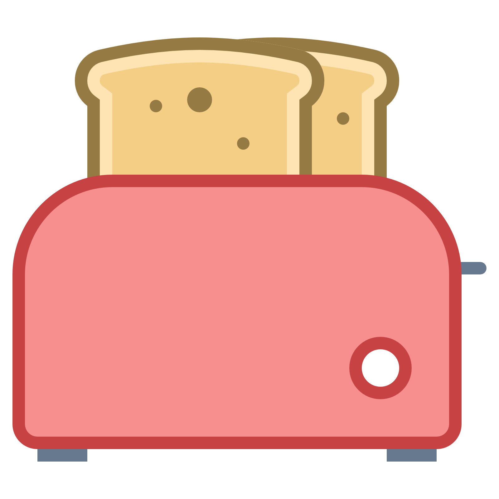

# Inversion of Control Kata

Your employer is a fast growing start-up competing in the android hardware market with companies like Samsung, Huawei and Sony. The team put all their effort into the development of custom system apps (phone and camera) and a launcher application for tablet's and phones.

Since Internet of Things is becoming a thing, your board decided to invest into the fast growing market of smart toasters!

Challenge accepted you said and quickly added a toaster widget to your launcher application - DONE!!!!

When the first prototype of the toaster arrived you tried to deploy the app and suddenly got this error: **Not enough memory**. Why is that? Well the launcher you deployed on the toaster still contains the code for all the not needed apps like phone, browser etc. .

# Task

The goal of the kata is to create a separate artefact for the toaster device which should just
contain the `launcher` and the `toaster app`. In order to achieve this you will need to create different modules for the `launcher` and each `app`.

# Bonus

When there is still time left, try to go further and have an app module per device. E.g. a ToasterApp, PhoneApp & TabletApp.

# Hint
Introducing modules per app will make the `DeviceFeature` at some point obsolete.

# Setup
Copy the **default** folder and name it according to your team, e.g. **volker_joe**.

You will find a project using a very basic **Dagger2** setup. In order to simulate the different devices (phone, tablet, toaster), just manually change the AndroidDeviceFeature.
When launching the app you should see a launcher with the apps that your device supports.
